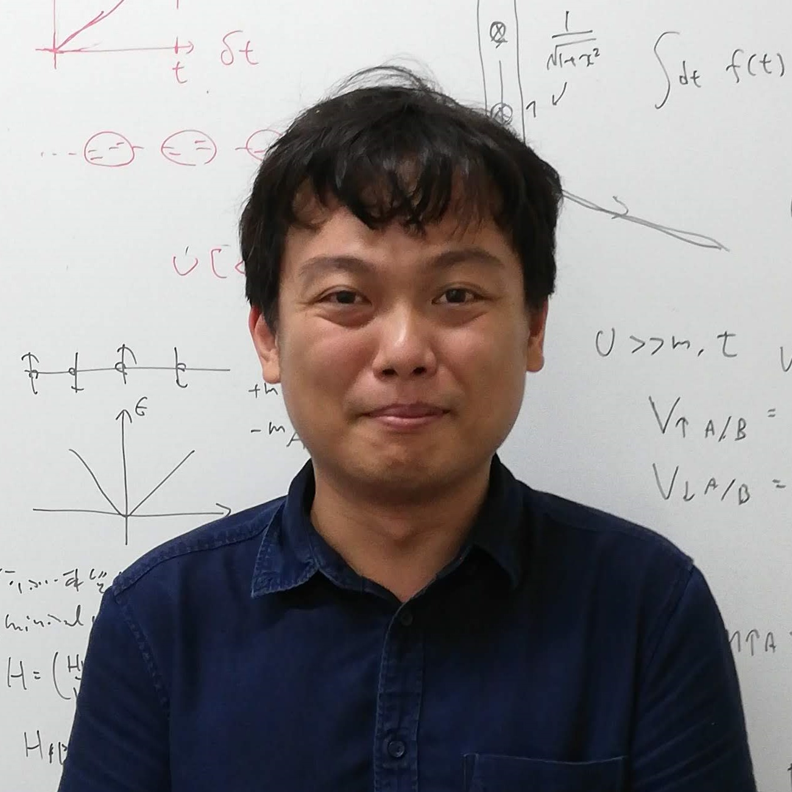

Research Associate, University of Tokyo  
東京大学大学院 工学系研究科 物理工学専攻 森本研究室 助教

kitamura 0x40 ap.t.u-tokyo.ac.jp  

7-3-1 Hongo, Bunkyo-ku, Tokyo 113-8656 Japan  
〒113-8656 東京都文京区本郷7-3-1 工学部6号館221号室

**Research Interests:**  
condensed matter theory, nonequilibrium quantum systems, Floquet engineering

---

### 学歴

2008年3月 | 岡山県立岡山朝日高校卒業
2012年3月 | 東京大学理学部物理学科卒業
2014年3月 | 東京大学大学院理学系研究科物理学専攻 修士課程修了
2017年3月 | 東京大学大学院理学系研究科物理学専攻 博士課程修了

### 職歴

2012年10月 - 2017年3月| フォトンサイエンス・リーディング大学院 (ALPS) コース生
2017年4月  - 2019年3月| マックスプランク複雑系物理学研究所 博士研究員
2019年4月 -| 東京大学大学院工学系研究科物理工学専攻  森本研究室 助教

### Thesis

Ph.D thesis:  
[_"Theoretical study of exotic quantum phases in periodically-driven systems"_](http://doi.org/10.15083/00075562)  
(周期駆動系における新奇量子相の理論的研究)  
Adviser: Prof. Hideo Aoki (2014-2015), Prof. Shinji Tsuneyuki (2016)  

Master thesis:  
_"First principles band calculation for cold atom systems in optical lattices"_  
(光学格子上の冷却原子系に対する第一原理バンド計算)  
Adviser: Prof. Hideo Aoki

### Publications

1. S. Kitamura, H. Usui, R.-J. Slager, A. Bouhon, V. Sunko, H. Rosner, P. D. C. King, J. Orenstein, R. Moessner, A. P. Mackenzie, K. Kuroki, and T. Oka:  
_"Spin Hall effect in 2D metallic delafossite PtCoO2 and vicinity topology"_,  
[arXiv:1811.03105](https://arxiv.org/abs/1811.03105).

1. V. Sunko\*, F. Mazzola\*, S. Kitamura\*, S. Khim, P. Kushwaha, O. J. Clark, M. Watson, I. Marković, D. Biswas, L. Pourovskii, T. K. Kim, T.-L. Lee, P. K. Thakur, H. Rosner, A. Georges, R. Moessner, T. Oka, A. P. Mackenzie, and P. D. C. King:  
_"Probing spin correlations using angle resolved photoemission in a coupled metallic/Mott insulator system"_,  
[arXiv:1809.08972](https://arxiv.org/abs/1809.08972).

1. H. Usui, M. Ochi, S. Kitamura, T. Oka, D. Ogura, H. Rosner, M. W. Haverkort, V. Sunko, P. D. C. King, A. P. Mackenzie, and K. Kuroki:  
_"Hidden Kagome-lattice picture and origin of high conductivity in delafossite PtCoO2"_,  
[Phys. Rev. Mat. **3**, 045002 (2019)](https://journals.aps.org/prmaterials/abstract/10.1103/PhysRevMaterials.3.045002).  
[Editors' Suggestion] [[arXiv]](https://arxiv.org/abs/1812.07213)

1. Takashi Oka and Sota Kitamura:  
_"Floquet Engineering of Quantum Materials"_,  
[Ann. Rev. Cond. Mat. Phys. **10**, 387-408 (2019)](https://www.annualreviews.org/doi/abs/10.1146/annurev-conmatphys-031218-013423).  
[[arXiv]](https://arxiv.org/abs/1804.03212)

1. Chanchal Sow, Shingo Yonezawa, Sota Kitamura, Takashi Oka, Kazuhiko Kuroki, Fumihiko Nakamura, and Yoshiteru Maeno:  
_"Current-induced strong diamagnetism in the Mott insulator Ca2RuO4"_,  
[Science **358**, 1084-1087 (2017)](http://science.sciencemag.org/content/358/6366/1084).  
[[arXiv]](https://arxiv.org/abs/1610.02222) [[プレスリリース]](http://www.kyoto-u.ac.jp/ja/research/research_results/2017/171124_1.html) [[日刊工業新聞]](https://www.nikkan.co.jp/articles/view/00451939)

1. Leda Bucciantini, Sthitadhi Roy, Sota Kitamura, and Takashi Oka:  
_"Emergent Weyl nodes and Fermi arcs in a Floquet Weyl semimetal"_,  
[Phys. Rev. B **96**, 041126\(R\) (2017)](https://journals.aps.org/prb/abstract/10.1103/PhysRevB.96.041126).  
[[arXiv]](https://arxiv.org/abs/1612.01541)

1. Sota Kitamura, Takashi Oka, and Hideo Aoki:  
_"Probing and controlling spin chirality in Mott insulators by circularly polarized laser"_,  
[Phys. Rev. B **96**, 014406 (2017)](https://journals.aps.org/prb/abstract/10.1103/PhysRevB.96.014406).  
[[arXiv]](https://arxiv.org/abs/1703.04315)

1. Sota Kitamura and Hideo Aoki:  
_"$\eta$-pairing superfluid in periodically-driven fermionic Hubbard model with strong attraction"_,  
[Phys. Rev. B **94**, 174503 (2016)](https://journals.aps.org/prb/abstract/10.1103/PhysRevB.94.174503).  
[[arXiv]](https://arxiv.org/abs/1511.07890)

1. Takahiro Mikami, Sota Kitamura, Kenji Yasuda, Naoto Tsuji, Takashi Oka, and Hideo Aoki:  
_"Brillouin-Wigner theory for high-frequency expansion in periodically driven systems: Application to Floquet topological insulators"_,  
[Phys. Rev. B **93**, 144307 (2016)](https://journals.aps.org/prb/abstract/10.1103/PhysRevB.93.144307).  
[[arXiv]](https://arxiv.org/abs/1511.00755)

1. Sota Kitamura, Naoto Tsuji, and Hideo Aoki:  
_"Interaction-Driven Topological Insulator in Fermionic Cold Atoms on an Optical Lattice: A Design with a Density Functional Formalism"_,  
[Phys. Rev. Lett. **115**, 045304 (2015)](https://journals.aps.org/prl/abstract/10.1103/PhysRevLett.115.045304).  
[[arXiv]](https://arxiv.org/abs/1411.3345)

